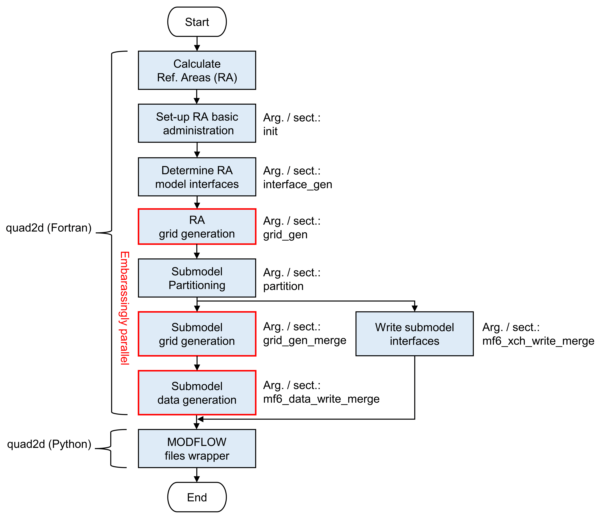

# quad2d
The quad2d tools can be used for setting up and running a parallel, quadtree-based, MODFLOW 6 model using refinement areas. Parallel pre-processing is supported using [VRT](https://gdal.org/drivers/raster/vrt.html) and [Ehdr](https://gdal.org/drivers/raster/ehdr.html) raster tiles. For simulation, a new distributed memory parallel prototype of MODFLOW 6 is being used, that has been developed together with the United States Geological Survey (https://github.com/verkaik/modflow6-parallel.git, https://doi.org/10.5281/zenodo.5778658). The quad2d tools are recently applied to construct a prototype for the new Netherlands' National Flexible Groundwater Model:

Verkaik, J., Oude Essink, G.H.P., Bierkens, M.F.P., Lin, H.X. Construction of a national, flexible, groundwater model for the Netherlands using high performance computing: towards one unified model for national-scale and regional-scale modeling. *In preparation*.

## Installation

The [quad2d](/fortran/src/quad2d/quad2d.f90) Fortran program requires compilation using e.g. [Intel](https://www.intel.com/content/www/us/en/developer/tools/oneapi/fortran-compiler.html#gs.hn3ht0) or [GNU](https://gcc.gnu.org/fortran/). Regarding dependencies, a ([makefile](/fortran/src/quad2d/makefile_example)) example is provided. The code should be linked with [METIS](http://glaros.dtc.umn.edu/gkhome/metis/metis/download) that has been compiled at 64-bit precision. For running the model, the parallel MODFLOW 6 code should be compiled with a Fortran compiler and linked with the Message Passing Interface library. The [quad2d](/python/quad2d/quad2d.py) Python program uses [Python 3](https://www.python.org/downloads/) and requires the installation of the [Jinja2](https://pypi.org/project/Jinja2/) package. The pre-processing workflow is given below, where the command-line arguments and corresponding section of the INI input files are denoted for each step.

## Disclaimer

Quad2d is released under the GPL license v3.0 (see [LICENSE](LICENSE)). All data and software provided with this model come with ABSOLUTELY NO WARRANTY.
